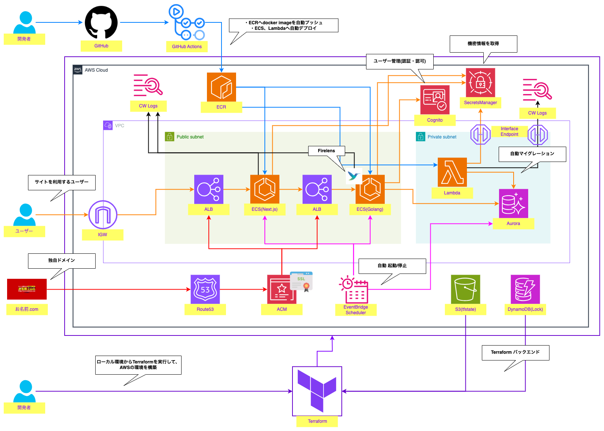

# エレベーターピッチとは
プロダクトの概要を簡潔に説明するための手法。

# エレベーターピッチ
1. ターゲットユーザーは？  
情報収集に時間をかけたくない、情報が散逸している人。

2. （ターゲットユーザーの）抱えている課題や潜在的なニーズは？  
ネット検索やSNSでは情報が散逸しており、情報収集に時間がかかる。
クレジットカードの作り方や結婚までのロードマップ、スキルアップするためのロードマップなど、
すぐに知りたい情報が集約されているWebサイトが求められている。

3. プロダクトの名称は？  
RoadmapHub  
Roadmap: ロードマップとは、目標達成のための計画や手順を示すもの。ユーザーが、目指すべき方向を示す。  
Hub: ハブとは、中心地や中心部を意味する。ユーザーが、必要な情報を一箇所で見つけられることを強調している。

4. プロダクトのカテゴリは？  
情報集約・ロードマップ共有サイト

5. プロダクトの重要な利点、対価に見合う説得力のある理由は？  
情報の一元化: 必要な情報を一箇所に集約。  
時間の節約: 効率的に情報収集。  
信頼性: 正確な情報を提供。

6. プロダクトの最も保守的な代替手段は？  
ネット検索やSNSで個別に情報を集める。

7. （保守的な代替手段と比べて）差別化の決定的な特徴は？  
集約された情報: 散逸している情報を一箇所にまとめる。  
簡単な検索: 必要な情報をすぐに見つけられる。  
視覚的なロードマップ: わかりやすい形式で情報を提供。

8. まとめ  
「RoadmapHub」は、クレジットカードの作成手順や結婚準備などのロードマップを一箇所に集約する情報共有サイトです。  
ネット検索やSNSで散逸している情報を効率的に集めることができ、時間を大幅に節約できます。  
わかりやすいロードマップ形式で、信頼性の高い情報を提供します。  
「RoadmapHub」で、情報収集をもっと簡単に、迅速に。

# ワイヤーフレーム（Figma）
https://www.figma.com/design/gatM8ZlGsOcfVa1bYibKAs/RoadmapHub?node-id=13-42&t=D14kIP9EApyI8RYc-1

# AWS全体構成図
- AWSの全体構成図です。
- その他の機能は下記の通りです
  - ECS Blue/Green Deployment
  - Firelensによるログ形式の変更やCloudWatch Logsへの出力
  - ハッシュ値を用いたECRイメージのバージョン管理

